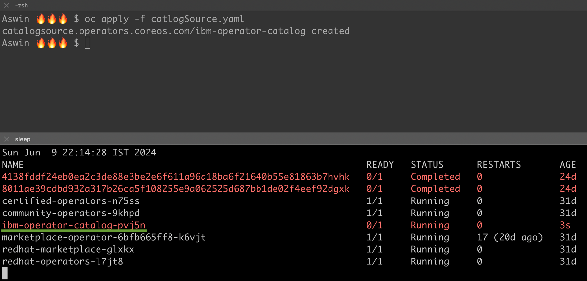
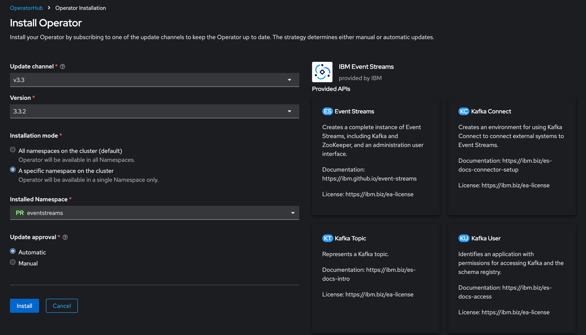

# Installing IBM Event Streams and Exploring Its Features

## Introduction
Welcome to the second part of our blog series on IBM Event Streams! In the previous part, we covered the basics of Apache Kafka, the benefits of running Kafka on Kubernetes, and introduced IBM Event Streams and its components. In this part, we will guide you through the installation process of IBM Event Streams, showcase the Event Streams UI, and demonstrate the starter application.

## Creating an Image Pull Secret
Before installing an Event Streams instance, create an image pull secret named `ibm-entitlement-key` in the target namespace to enable pulling container images from the registry.

- Obtain an Entitlement Key from the IBM Container software library.
- Create the Secret in the target namespace using the following command

```bash
oc create secret docker-registry ibm-entitlement-key --docker-username=cp --docker-password="<your-entitlement-key>" --docker-server="cp.icr.io" -n <target-namespace>
```

**Note**: If the secret is not created, pods will fail to start with `ImagePullBackOff` errors. Ensure the secret is created and allow the pod to restart.

## Creating a Project and Switching the Namespace to EventStreams
To get started with IBM Event Streams, you need to create a new project (namespace) and switch to it. Follow these simple steps:

### Create a New Project/Namespace
Run the following command to create a new namespace called eventstreams

```bash
oc create ns eventstreams
```

### Switch to the EventStreams Project
Use this command to switch to the newly created eventstreams namespace

```bash
oc project eventstreams
```

By setting up and switching to the eventstreams namespace, you ensure that all subsequent operations are scoped to this environment, keeping your resources organized and isolated.

## Adding IBM Operator Catalog Source
The first step is to create a file for the IBM Operator Catalog source. Follow these steps

### Create the Catalog Source File

```yaml
apiVersion: operators.coreos.com/v1alpha1
kind: CatalogSource
metadata:
   name: ibm-operator-catalog
   namespace: openshift-marketplace
   labels:
     backup.eventstreams.ibm.com/component: catalogsource
spec:
   displayName: "IBM Operator Catalog"
   publisher: IBM
   sourceType: grpc
   image: icr.io/cpopen/ibm-operator-catalog
   updateStrategy:
     registryPoll:
       interval: 45m
```

### Apply the Catalog Source

```bash
oc apply -f catalogSource.yaml
```



## Install the EventStreams Operator
Once the CatalogSource is ready, the EventStreams operator will be available in the Operator Hub for installation. Navigate to the Operator Hub in your OpenShift console and install the EventStreams operator.


### Choose the Operator Installation Mode
Before installing the Event Streams operator, decide on the installation mode

#### All Namespaces (Default)

- Manages Event Streams instances in any namespace.
- Select All namespaces on the cluster.
- The operator is deployed in the openshift-operators namespace.

Single Namespace

- Manages Event Streams instances in a specified namespace only.
- Select A specific namespace on the cluster.
- The operator is deployed in the specified namespace.

Here, we are using the Single Namespace install mode.



Once the operator is installed, you can see that the eventstreams-cluster-operator is up and running in the eventstreams namespace.


Once the operator is ready, you can run the following command to see the list of CRDs supported by Event Streams

```bash
Aswin 🔥🔥🔥 $ oc get crd | grep eventstreams
eventstreams.eventstreams.ibm.com                                 2024-06-09T17:01:24Z
eventstreamsgeoreplicators.eventstreams.ibm.com                   2024-06-09T17:01:24Z
kafkabridges.eventstreams.ibm.com                                 2024-06-09T17:01:23Z
kafkaconnectors.eventstreams.ibm.com                              2024-06-09T17:01:23Z
kafkaconnects.eventstreams.ibm.com                                2024-06-09T17:01:23Z
kafkamirrormaker2s.eventstreams.ibm.com                           2024-06-09T17:01:22Z
kafkanodepools.eventstreams.ibm.com                               2024-06-09T17:01:23Z
kafkarebalances.eventstreams.ibm.com                              2024-06-09T17:01:23Z
kafkas.eventstreams.ibm.com                                       2024-06-09T17:01:22Z
kafkatopics.eventstreams.ibm.com                                  2024-06-09T17:01:23Z
kafkausers.eventstreams.ibm.com                                   2024-06-09T17:01:23Z
strimzipodsets.core.eventstreams.ibm.com                          2024-06-09T17:01:23Z
Aswin 🔥🔥🔥 $
```

Now you can install Event Streams by navigating to IBM Event Streams on the Installed Operators page and selecting the appropriate deployment options. Event Streams provides a number of samples to choose from.

- Lightweight without security
- Development
- Minimal production
- Production 3 brokers
- Production 6 brokers
- Production 9 brokers


Here, I am choosing a sample called "Development SCRAM". After accepting the license, click on "Create." This will bring up the Zookeeper, Kafka, Entity Operator, Apicurio Registry, Admin API, and EventStreams UI pods.


## Accessing the Event Streams Admin UI

Once Event Streams is up and running, navigate to Installed Operators and select the IBM Event Streams instance. You will see the Admin UI URL, as shown in the image. Click on this URL to go to the Event Streams login page. The login page you see will be the SCRAM login page. Event Streams supports different login options.


## Different Login Options Supported by Event Streams
Event Streams supports various login options to ensure secure access to the Event Streams UI and CLI. Depending on the configured authentication type, you can log in using:

- **IBM Cloud Pak IAM Users**: Use IBM Cloud Pak foundational services Identity and Access Management (IAM) credentials for secure access.
- **SCRAM-SHA-512 Authentication**: Log in with Kafka users configured for SCRAM-SHA-512 authentication. This method requires the username and password of the Kafka user and provides access based on the user's ACL permissions.
- **Keycloak Integration**: Use Keycloak as part of IBM Cloud Pak for Integration. Users need an eventstreams-admin or admin role for access. Keycloak can manage users and groups directly or connect to LDAP, OpenID Connect (OIDC), or SAML identity providers.

For proof of concept (PoC) environments, it's possible to configure Event Streams UI to not require a login, though this is not recommended for production use. Each method offers different levels of security and integration capabilities to match various organizational needs.


## Logging in to Event Streams UI Using SCRAM Credentials

To log in to the Event Streams UI using SCRAM credentials, you first need a KafkaUser configured for SCRAM-SHA-512 authentication. For this demo, we'll create a KafkaUser using the following sample

```yaml
apiVersion: eventstreams.ibm.com/v1beta2
kind: KafkaUser
metadata:
  labels:
    eventstreams.ibm.com/cluster: dev-scram
  name: dev-scram-admin
  namespace: eventstreams
spec:
  authentication:
    type: scram-sha-512
  authorization:
    acls:
      - operations:
          - All
        resource:
          name: '*'
          patternType: literal
          type: topic
      - operations:
          - All
        resource:
          name: '*'
          patternType: literal
          type: group
      - operations:
          - All
        resource:
          type: cluster
    type: simple
```

### Apply the KafkaUser Configuration

Apply the above configuration using the following command

```sh
oc apply -f kafkauser.yaml
```

### Check KafkaUser Status

Switch to the KafkaUser tab in your OpenShift console or run the following command to check if the KafkaUser is in a ready state

```bash
oc get kafkauser -n eventstreams | grep dev-scram-admin
```

### Extract KafkaUser Password

Once the KafkaUser is ready, run the following command to extract the KafkaUser password

```bash
kubectl get secret dev-scram-admin -n eventstreams -o jsonpath="{.data.password}" | base64 --decode
```

Use the extracted password along with the KafkaUser name (dev-scram-admin) to log in to the Event Streams UI.

Once you log in, you will see the page below. This page has various options, which we will discuss later in this series.


### Trying the Starter Application
Now let's try the starter application to see Event Streams Kafka in action. The starter application is a complete Java project containing a Kafka producer and consumer, allowing you to quickly test Event Streams by producing and consuming sample data.


## Download the JAR
First, download the starter application JAR file.

### Generate Properties File and Download ZIP
Follow the instructions on the starter application page to generate the properties file and download the ZIP.

### Run the Starter Application
Run the command provided on the starter application page to start the application.


Once the application is started, navigate to localhost:8080 in your browser to produce and consume messages.


You can now see the messages in the topic by clicking on the topic icon in the hamburger menu on the right side of the Event Streams UI


In this part, we walked through the process of setting up IBM Event Streams, configuring SCRAM authentication, and trying out the starter application to see Kafka in action. We also explored how to navigate the Event Streams UI to view messages in topics.

Stay tuned for part 3 of our blog series, where we will dive into the Apicurio Registry and discuss the problems it solves in managing schemas for Kafka messages.