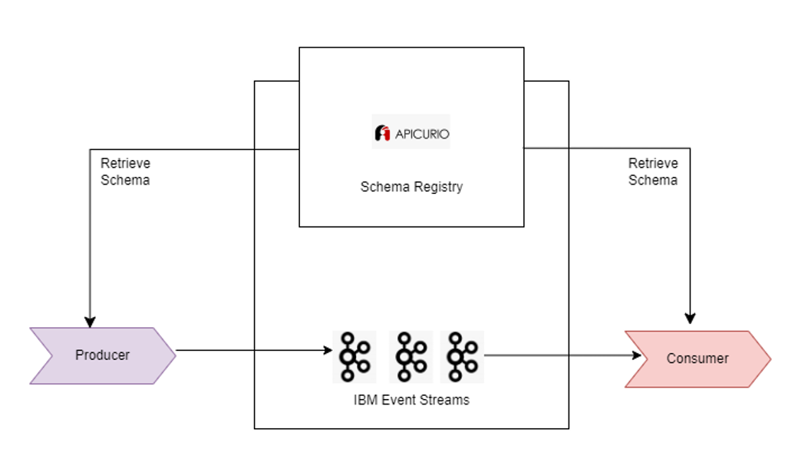

# Understanding Schemas and Schema Registry in Event Streams
In Apache Kafka, schemas play a crucial role in ensuring data consistency and structure across messages exchanged between producers and consumers. While Kafka itself can handle any data, schemas define the specific format and structure of the data within messages, ensuring that both producers and consumers interpret data correctly.

## Why Kafka Needs Schemas
Schemas provide a predefined structure for data in Kafka messages, facilitating efficient data handling and interpretation. They specify the fields and their types, ensuring consistency across data exchanges.

## What is a Schema Registry?
The Apicurio Registry, integrated into IBM Event Streams, serves as an open-source schema registry for managing and versioning schemas. It stores schemas in Kafka's internal topics, providing versioned history and an interface for retrieving schemas.

## Apicurio Schema Registry in Event Streams
Each Event Streams cluster hosts its own instance of the Apicurio Registry, enabling producers and consumers to validate data against registered schemas. This ensures data conformity without needing to transmit schemas within messages, thus optimizing message size and network usage.

## Using Apicurio with IBM Event Streams

Event Streams supports Apache Avro as the schema format, which offers efficient binary serialization. Producers serialize data according to a schema, embedding a unique identifier that references the schema in the registry. Consumers then use this identifier to fetch and deserialize data correctly.

## Serialization and Deserialization
Producers use serializers to encode data in Avro format, including the schema identifier. Consumers use deserializers to retrieve schemas from the registry and decode messages accordingly, ensuring data integrity and structure.

## Versions and Compatibility:
Apicurio Registry manages schema versions, allowing schemas to evolve while maintaining backward compatibility. Producers and consumers can continue using older versions until they are updated to newer ones, preventing disruptions in data flow.

## Schema Lifecycle Management
Through the Event Streams UI or CLI, administrators can manage schema lifecycles by registering, versioning, deprecating, and eventually removing schemas. This flexibility supports agile schema evolution based on changing business requirements.

In the next part of our series, we will delve deeper into Apicurio Registry's functionalities and explore practical use cases for managing schemas effectively within IBM Event Streams.