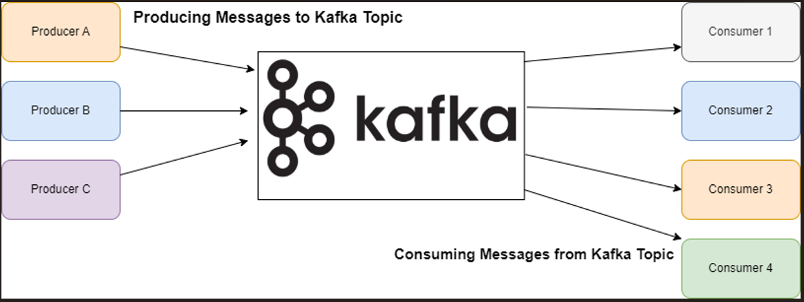
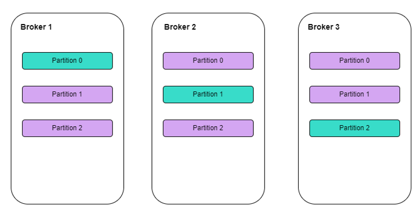
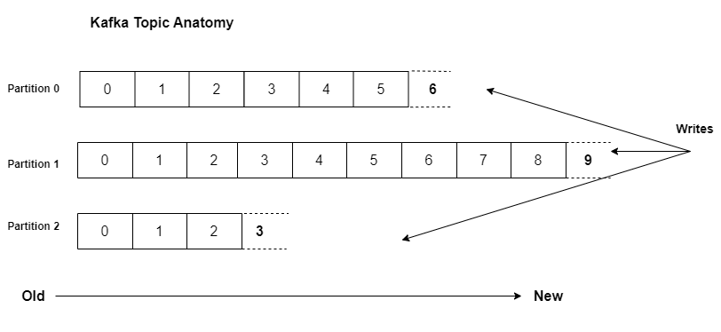
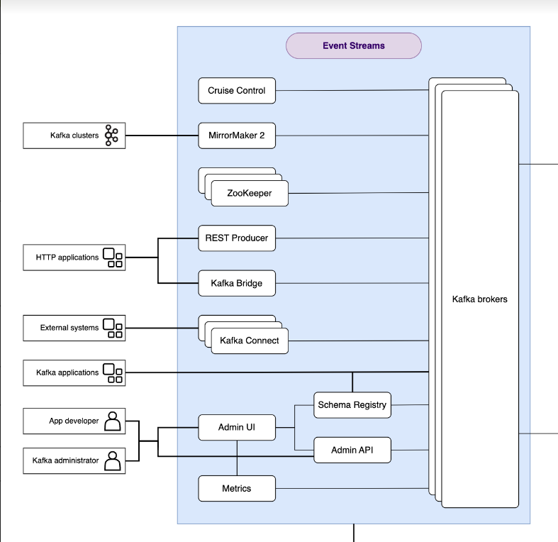

# Part 1: Introduction to IBM Event Streams and Kafka
## 1. Introduction
Welcome to the first part of our blog series on IBM Event Streams! In this series, we will explore IBM Event Streams, its architecture, components, and how to leverage it for building robust event-driven applications. This part will introduce you to Apache Kafka, its importance, why running Kafka on Kubernetes is beneficial, and a detailed look at IBM Event Streams.

## 2. What and Why Kafka
### Overview of Apache Kafka

Apache Kafka is an open-source distributed event streaming platform used by thousands of companies for high-performance data pipelines, streaming analytics, data integration, and mission-critical applications. Originally developed by LinkedIn and open-sourced in 2011, Kafka has become a key technology for managing and processing real-time data streams.

### Core Concepts of Kafka

**Producers**: Applications that publish (or write) data to Kafka topics.

**Consumers**: Applications that subscribe to (or read) data from topics and process the data.

**Brokers**: Kafka servers that store data and serve it to consumers.

**Topics**: Categories to which records are published.

**Partitions**: Subsets of topics that allow parallel processing.

**Consumer Group**: A consumer group in Kafka is a collection of consumers that work together to read data from Kafka topics. Each consumer in the group processes data from different partitions, ensuring that the workload is balanced and messages are processed efficiently.

### Kafka at a high level

### Unveiling the Secrets of a Kafka Broker

Leader (Blue) , Replica (Purple)

In Kafka, an `offset` is a unique identifier for each record within a partition of a topic. It represents the position of a record in the sequence of records and is used to track and manage the order and retrieval of messages.

### Topics: Think of Categories

Imagine a busy news organization. Reporters are constantly generating stories on various topics – politics, sports, business, etc. In Kafka, a topic acts like a category for these stories. You can have a topic for "sports-news," another for "business-updates," and so on.  Each topic holds a stream of related messages, similar to how each news category holds a stream of articles.

### Partitions: Dividing the Stream

Now, within each topic, there can be a significant volume of messages. To handle this efficiently, Kafka allows you to divide the topic into smaller streams called partitions.  Think of it like subcategories within a news topic.  For example, the "sports-news" topic could have partitions for "football," "basketball," and "tennis." Each partition holds a portion of the overall messages related to that sport.

### Benefits of Partitions

**Scalability**: As the volume of messages increases, you can add more partitions to a topic, distributing the load and improving performance. Imagine adding more sports-specific reporters, each feeding stories into their respective partition.

**Parallel Processing**: Consumers (applications reading the data) can subscribe to specific partitions or the entire topic. This allows for parallel processing, where multiple consumers can handle messages concurrently. Think of multiple editors working on different sports articles simultaneously.

**Fault Tolerance**: If a broker (server) storing a partition fails, Kafka automatically replicates the data to another broker. This ensures message delivery even during outages. Imagine a backup reporter for each sport, ready to take over if the main one encounters an issue.

### Example: E-commerce Website

Let's see how topics and partitions work in a real-world scenario. Imagine an e-commerce website:

**Topic**: `user-activity`

**Partitions**: 
  - purchase-confirmation
  - add-to-cart
  - product-browsing

Producers (website servers) send messages to the `user-activity` topic based on user actions. These messages get distributed across the partitions. Consumers (backend services) can subscribe to specific partitions:

- A service responsible for order processing might only need the `purchase-confirmation` partition.
- Another service personalizing product recommendations might be interested in the `add-to-cart` and `product-browsing` partitions.

This way, each service efficiently handles the relevant data stream, improving overall processing speed and user experience.

### Why Kafka?

Kafka is widely used for its high throughput, fault tolerance, and scalability. These features make it suitable for a variety of use cases, such as:

**Real-Time Analytics**: Processing and analyzing streams of data in real-time to gain immediate insights.

**Data Pipelines**: Ingesting, storing, and processing large volumes of data with minimal latency.

**Event Sourcing**: Designing applications where state changes are logged as a sequence of events.

**Log Aggregation**: Collecting and aggregating logs from multiple sources for monitoring and analysis.

## Why Running Kafka on Kubernetes Matters

### Introduction to Kubernetes

Kubernetes is an open-source platform designed to automate deploying, scaling, and operating application containers. It provides a container-centric infrastructure that allows for efficient management of containerized applications in a clustered environment.

### Benefits of Running Kafka on Kubernetes

**Scalability**: Kubernetes makes it easier to scale Kafka clusters by adding or removing broker nodes dynamically.

**Resilience**: Kubernetes offers built-in mechanisms for automatic healing and load balancing, ensuring high availability of Kafka services.

**Resource Management**: Efficient resource allocation and management, allowing better utilization of hardware.

**DevOps and CI/CD**: Seamless integration with modern development workflows and continuous integration/continuous deployment (CI/CD) pipelines.

### Challenges and Solutions

While running Kafka on Kubernetes offers significant benefits, it also introduces some challenges, such as the complexity of setup and management. However, tools like Helm charts and Kubernetes Operators can simplify the deployment and management of Kafka on Kubernetes, making it more accessible.

## 4. What is IBM EventStreams
### Overview of IBM Event Streams

IBM Event Streams is an event-streaming platform based on Apache Kafka, enhanced with Strimzi technology for resilient and manageable deployment on Kubernetes. It offers additional capabilities to extend Kafka’s core functionality.

### Components of IBM Event Streams

#### Kafka Brokers

- Deployed by Strimzi across Kubernetes nodes.
- Ensures high availability and resilience.

#### Administrative User Interface (UI)

- Manages production clusters.
- Controls topic lifecycle, filters and browses messages, analyzes metrics, manages schema and geo-replication, and generates connection details.
- Includes tools like a sample starter and producer application.

#### Command-Line Interface (CLI)

- Manages clusters manually or through scripts.
- Inspects brokers, manages topics, deploys schemas, and handles geo-replication.

#### Geo-Replication

- Simplifies topic replication between clusters.

#### REST API

- Produces messages to Event Streams topics, expanding event source possibilities.

#### Schema Registry

- Supports message format definitions and enforcement between producers and consumers.
- Uses Apicurio Registry for managing schemas.

#### Health Check Information

- Identifies issues with clusters and brokers.

#### Secure Production Cluster Templates

- Includes authentication, authorization, and encryption by default.
- Provides optional configurations for development environments.

#### Granular Security Configuration

- Uses Kafka access control lists to configure authorization and quotas for applications.

### What is a Kubernetes Operator?
Kubernetes Operators are tools designed to simplify the deployment and management of complex applications on Kubernetes. They package and abstract the knowledge needed to deploy, configure, and operate an application, making it easier to manage the entire lifecycle of that application. By providing new Kubernetes constructs, Operators help automate tasks that would otherwise require manual intervention.

### The Problem Operators Solve
Managing complex applications, like Kafka, can be challenging due to the need for precise configuration, scaling, and maintenance. Kubernetes Operators address these challenges by:

- Automating deployment and scaling.
- Simplifying configuration management.
- Providing continuous monitoring and self-healing capabilities.
- Reducing the operational burden on DevOps teams.

### Deploying Kafka with Event Streams Using Operators
#### Strimzi and Event Streams
Strimzi uses Kubernetes Operators to deploy Kafka clusters efficiently. IBM Event Streams builds on Strimzi, adding extra features and components to enhance Kafka’s capabilities.

#### How It Works

#### EventStreams Resource

- Event Streams introduces a new Kubernetes resource type called EventStreams, allowing users to define Kafka deployments in a standard YAML file.
- This YAML file specifies all components, including Kafka brokers, ZooKeeper nodes, and additional Event Streams features.

#### Cluster Operators

- Strimzi Cluster Operator : Manages core Kafka components like brokers and ZooKeeper nodes.
- EventStreams Cluster Operator : Extends the Strimzi operator to deploy additional Event Streams features alongside core Kafka components.

#### Entity Operator

- Manages authentication and authorization within Kafka through the KafkaUser custom resource.
- Optionally manages Kafka topics using the KafkaTopic custom resource, though topics can also be managed through the Event Streams UI, CLI, and REST API.

#### Benefits

- Streamlined Deployment: Deploy Kafka clusters with a single YAML file.
- Enhanced Management: Utilize Event Streams UI and CLI for easier management.
- Scalability and Resilience: Leverage Kubernetes for automatic scaling and high availability.

## 7. Conclusion
In this part, we covered the basics of Apache Kafka, the advantages of running Kafka on Kubernetes, and an introduction to IBM Event Streams and its components. Stay tuned for the next part of our series, where we will guide you through the installation process, showcase the Event Streams UI, and demonstrate the starter application, along with exploring advanced configurations and use cases.
